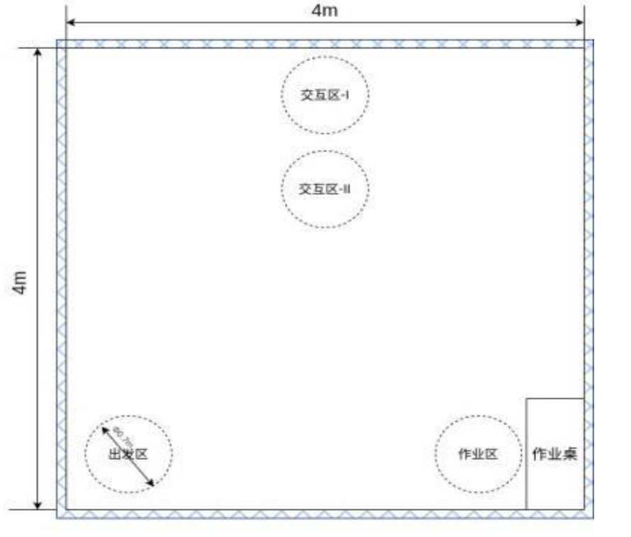

# 2026 睿抗机器人开发者大赛 CAIM 工创赛道智能制造赛项
## AGI 具身智能服务机器人赛题（智慧养老组）—— 省级合并选拔赛线上赛规则文件
*2026年5月*

---

## 选手须知

### 1. 第一阶段：工程文档与视频评审规范
* **材料提交明细**：参赛队伍须按要求打包提交以下两类核心材料：
    * **工程文档类**：系统完整运行代码包（确保依赖完整，可独立编译与运行）；项目实施与技术说明文档（Word 格式，详述系统架构与实施方案）。
    * **演示视频类**：任务一仿真环境完整运行录屏（不间断原生录制）；灵创平台模型训练结果导出视频。
* **打包与命名**：须将上述所有文档与视频归入同一文件夹中，并压缩打包。文件命名格式为：学校名称+队伍名称+队长姓名+联系电话。
* **提交地址**：15698421209@163.com。
* **截止日期**：2026年6月26日 19:00（以系统收件时间戳为准，逾期视为放弃该项得分）。

### 2. 第二阶段：任务仿真
* **比赛日期**：2026年6月29日（比赛期间参赛队伍自行录屏，竞赛结束后统一提交）。
* **作品提交**：赛事代码、文档上传地址为 https://open.agibot.com/competition/3?tab=submit 。
* **上传权限**：睿抗报名时填写的队伍联系人有上传权限（一般为队长/指导老师）。
* **截止日期**：所在省省赛结束后 7 天内。
* **设备要求**：每支队伍自备笔记本电脑及 U 盘等参赛设备，并预装仿真平台。
* **平台链接**：灵创平台链接为 https://linkcraft.agibot.com 。

### 3. 匿名要求
* 以上阶段的工程文档、视频、仿真、实操中均不得出现参赛人员姓名、学校、指导教师等信息。

### 4. 交流对接
* 请参赛队员加入 QQ 群 “2026睿抗CAIM-AGI(智慧养老组)省级合并选拔赛” 以便对接。
* 评分细则、比赛出场顺序、出场时间安排均在此群内，群号：799763200。

---

## 一、项目概览
* **赛题名称**：AGI 具身智能服务机器人赛题（智慧养老组）
* **赛题简介**：本赛项紧扣“机器人+”应用行动实施方案，探索服务机器人赋能社会民生的创新应用。赛题围绕“养老陪护”，重点考察选手在具身智能感知、复杂环境导航、人机交互设计及系统协同控制方面的综合能力。依托智元机器人灵犀 X2 本体，旨在发掘具备工程实战能力与人文关怀精神的复合型技术人才，推动具身智能机器人从实验室走向多元化服务场景。

## 二、参赛要求
* **设备规范**：以智元灵犀 X2 为标准本体（带末端执行器），具体参数见附件1，相关二次开发文档可见链接：https://x2-aimdk.agibot.com/index.html 。
* **推荐平台（仅限专项赛）**：对于复杂交互开发需求，参赛队亦可借助官方提供的机器人内容创作与演绎平台——灵创平台（链接：https://linkcraft.agibot.com ），通过视频录制等方式进行零代码辅助开发。

## 三、竞赛场地及道具
* **场地规格**：赛场尺寸为 4000mm x 4000mm 的正方形平面区域（最终以实际场地为主），赛场四周有隔离带围挡。赛场内设置出发区、交互区（内设有 I 区和 II 区）和作业区。
* **道具清单**：物料、障碍物、标签等。
* **布局图示**：（具体地图信息以实际场地为主，包含出发区、交互区-I、交互区-II、作业区及作业桌）

## 四、竞赛任务
* 在比赛过程中，机器人应通过遥控或自主方式进行，不得人为和机器人本体进行接触干预。
* 正式比赛每支队伍一共限时 10 分钟，每支参赛队均可以有两次运行机会（须在规定时间内运行完成，次数耗尽或时间耗尽比赛结束），取两次现场运行的最好成绩作为现场决赛成绩。
* **初始状态**：机器人在【出发区】就位，完成系统自检，确认各功能模块运行正常，随时准备接收指令。机器人就绪后，参赛队员不得再触碰机器人。
* **任务1：定向移动**：裁判下发“开始”指令后，养老机器人需要通过遥控或自主导航的方式，走到【交互区-1】。
* **任务2：动作执行**：到达【交互区-1】后，机器人需要在该区域做目标舞蹈动作（详见附件1评分细则文件）。

## 五、成绩评定
1. **评分细则**：详见附件1评分细则文件，并以细则文件为准。
2. **违规扣分**：未按要求操作设备、携带违禁资料、操作过程中存在机器人摔倒或造成安全隐患、不服从裁判指令等。根据严重程度予以扣分或取消成绩。
3. **统分办法**：根据各个队伍结果客观评分，统计总分，按分数高低进行排名。按本科研究生组、高职组分别排名。
4. **特殊情况处理（如成绩并列）**：对于省赛，成绩并列时，按“任务1 定向移动”任务的得分高者排名靠前；如成绩一样，则按比赛时长较短的排名靠前。

## 六、其他说明
1. 规则最终解释权归组委会所有；
2. 技术细节更新以赛前睿抗官网/公众号发布的为准。

---

## 附件1：省级合并选拔赛线上赛评分细则

### 一、总则
#### 1. 成绩构成体系
本赛项总成绩满分为 100 分，考核体系由以下两部分构成：
* **1.1 工程文档与视频评审（占比 20%）**：满分 20 分。
* **1.2 线上实操竞技评审（占比 80%）**：满分 80 分。

#### 2. 同分排定规则
若参赛队伍最终总成绩出现并列，则依次按照以下规则进行排名判定：
* **2.1 规则一**：优先比较“任务一”的实操得分，得分高者排名靠前；
* **2.2 规则二**：若“任务一”得分一致，则比较“任务一”的运行耗时（T），用时短者排名优先；
* **2.3 规则三**：若上述各项指标均完全一致，则通过抽签机制决定最终排名。

#### 3. 技术与运行规范
* **3.1 操控方式限制**：本赛项倡导算法自主控制。若选手采用手动遥控方式（如通过键盘按键或模拟摇杆控制机器人行走等）完成比赛，对应任务的最终得分将按 50% 折算（即：任务实得分 = 任务分值 x 0.5）。
* **3.2 编程输入规范**：比赛过程中，允许且仅允许选手阅读官方指定的竞赛文档手册。严禁以任何形式复制、粘贴命令行/代码段至比赛终端，一经裁判组发现，当场判定制裁，该科目成绩记为无效。
* **3.3 算力平台限制**：参赛选手须使用本地物理计算设备，严禁使用任何形式的云算力平台。
* **3.4 边界判定规则**：在“任务一”运行过程中，机器人本体或其携带的任何部件一旦触碰赛道围挡，即判定为“出界”，当前任务直接宣告失败，记为 0 分。
* **3.5 视频防作弊要求**：选手提交的所有参赛视频必须为原生录制，严禁进行剪辑、加速、抽帧等任何后期二次处理。

#### 4. 线上赛时间与会议安排
* **竞赛时间**：2026年06月29日至2026年07月01日
* **时间段划分**：每日 09:00~12:00，14:30~17:30
* **线上赛腾讯会议号**：805-997-0933

#### 5. 竞赛纪律与线上监考标准
线上赛严格落实“双机位”实时监考标准，选手须在规定时段内接入会议。
* **5.1 机位一（主视角）**：全程共享参赛电脑屏幕。画面分辨率须满足裁判判罚要求，且保证全程无任何遮挡、无画面延迟。
* **5.2 机位二（全景监控）**：监控画面须同时且完整地覆盖：参赛选手本人（重点露出双臂及双手动作）、参赛电脑物理实体屏幕、键盘及鼠标。
* **5.3 违规判定**：若监控画面存在视觉死角、人为遮挡、静音，或经裁判组综合研判认定存在任何形式的违规作弊行为，将直接取消该参赛队伍的实操竞技成绩（记为 0 分）。
* **5.4 评审秩序与候场要求**：本次评审采用“单队依次接入”的独立评审机制。各参赛队伍须严格按照抽签编号接入腾讯会议。未届评审顺序的队伍，须在官方 QQ 通知群内静候裁判组指令，严禁擅自提前接入会议。

---

### 二、工程文档与视频提交规范与标准（总分 20 分）

#### 1. 提交流程与时效纪律
* **截止时间**：2026年6月26日 19:00（以系统收件邮箱时间戳为准，逾期未提交者视为自动放弃该项成绩）；
* **指定接收邮箱**：15698421209@163.com；
* **附件 campus 命名规范**：学校名称+队伍名称+队长姓名+队长联系电话。

#### （一）工程文档评审标准（总分 10 分）

| 序号 | 评分项 | 评分标准 | 分数 |
| :--- | :--- | :--- | :--- |
| 1 | 系统完整运行代码包 | 提交的完整工程文件必须能够独立运行和编译，最高记 5 分；未提交或代码文件损坏无法解析，最低记 0 分。 | 5 |
| 2 | 项目实施与技术说明文档 | 提交详述本赛项任务实施全流程、技术方案及完成情况的 Word 文档，文档详实方案可行，最高记 5 分；未提交或内容严重缺失，最低记 0 分。 | 5 |

#### （二）训练视频评审要求（总分 10 分）
* **前置审查要求**：视频中须明确展示灵创平台当前登录账号，供裁判核实身份。未通过核实或与他人账号重复使用者，本项成绩记为 0 分。
* **前置条件说明**：机器人抵达【交互区-1】后的舞蹈动作需满足以下技术要求：
    * 舞蹈动作总时长设定在 60~70 秒之间；
    * 舞蹈动作由选手自行设计，并采集参赛队员真人视频在灵创平台进行动作训练；
    * 动作编排须严格契合老年人康复训练（复健操）的生物力学特征，且设计时须兼顾实体机器人的动力学运行稳定性。

| 序号 | 评分项 | 评分标准 | 分数 |
| :--- | :--- | :--- | :--- |
| 1 | 任务一仿真环境运行录屏 | 视频须清晰、不间断地呈现任务一在仿真环境下的完整运行过程，完整呈现且成功运行，最高记 5 分；未提交或视频显示任务未完成，最低记 0 分。 | 5 |
| 2 | 灵创平台模型训练记录视频 | 提交基于灵创平台成功完成上述舞蹈模型训练的导出视频，视频合规且为本队自主训练，最高记 5 分；未提交或非本团队训练内容，最低记 0 分。 | 5 |

---

### 三、线上实操阶段评分标准（总分 80 分）

#### （二）任务一（最高 60 分）
本项得分由“任务完成度得分（最高 50 分）”与“系统运行效率得分（最高 10 分）”累加构成。

**1. 任务完成度评价标准（最高 50 分，按达成最高等级计分）**

| 序号 | 评级 | 任务表现与位置判定标准 | 分数 |
| :--- | :--- | :--- | :--- |
| 1 | 等级一 | **基础站立**：机器人在仿真环境内仅能实现自主稳定站立； | 10 |
| 2 | 等级二 | **无效位移**：机器人具备稳定行走能力，但行走终止后，机器人双足均未进入且未触碰【交互区-1】边界线。 | 20 |
| 3 | 等级三 | **单足入区**：机器人实现稳定站立及行走，但行走终止后，仅单侧足部进入【交互区-1】（含单足踩线或完全在区内），另一侧足部完全位于线外。机器人需正面面向【交互区-2】，若未实现正面面向，则扣减 10 分。 | 30 |
| 4 | 等级四 | **双足触线（未完全入区）**：机器人实现稳定站立及行走，行走终止后，双足均触及或进入【交互区-1】，外加存在踩线现象（即机器本体未完全跨越边界进入目标区域）。机器人需正面面向【交互区-2】，若未实现正面面向，则扣减 10 分。 | 40 |
| 5 | 等级五 | **完美达成**：机器人实现稳定站立及连续行走，且行走终止后，机器人整体姿态稳定，双足均严格处于【交互区-1】界线内（无踩线、无出界）。机器人需正面面向【交互区-2】，若未实现正面面向，则扣减 10 分。 | 50 |

**2. 运行效率（时间）评价标准（最高 10 分）**
* **操作与计时规范**：
    * 选手须提前进入 Ubuntu 系统界面并关闭所有终端后台。
    * 准备完毕后，向裁判口头示意“设备就绪”并申请开始比赛。
    * 裁判下达“开始”指令后开启秒表计时，同时选手方可触发代码运行。
    * 当选手向裁判明确示意“任务完成”或“主动放弃本阶段”时，秒表停止计时，记录运行耗时（T）。

| 序号 | 运行耗时（T） | 评分标准 | 分数 |
| :--- | :--- | :--- | :--- |
| 1 | 极速挡 | 整体运行时间：T <= 3分钟 | 10 |
| 2 | 标准档 | 整体运行时间：3分钟 < T < 5分钟 | 5 |
| 3 | 超时档 | 整体运行时间：T >= 5分钟 | 0 |

#### （三）任务二（最高 20 分）
* **前置审查要求**：选手须在实操中实时展示灵创平台内的舞蹈运行画面，并明确展示当前登录账号以供裁判核实身份。未通过核实者，本项不予计分。
* **前置条件说明**：机器人抵达【交互区-1】后的舞蹈动作需满足以下技术要求：
    * 舞蹈动作总时长设定在 60~70 秒之间；
    * 舞蹈动作由选手自行设计，并采集参赛队员真人视频在灵创平台进行动作训练；
    * 动作编排须严格契合老年人康复训练（复健操）的生物力学特征，且设计时须兼顾实体机器人的动力学运行稳定性。
* **评审展示方式**：参赛选手须使用电脑终端，向评审专家组在线实时演示其在灵创平台的训练与运行结果，作为评分依据。

| 序号 | 评分项 | 评分标准 | 分数 |
| :--- | :--- | :--- | :--- |
| 1 | 动作设计 | 机器人舞蹈内容初步符合复健操范畴，且时长达 60~70 秒。注：若动作编排存在过激、突兀等违背老年康复运动安全红线的行为，判定为“不符合复健操规范”，记为 0 分。 | 0~5 |
| 2 | 运行失稳或动作违规 | 机器人舞蹈内容基本符合复健操范畴，且时长达 60~70 秒。但在执行舞蹈过程中，机器人出现显著的机身晃动、步态踉跄、足底滑移或倾倒等失控现象。 | 5~10 |
| 3 | 运行平稳且高度规范 | 机器人舞蹈内容高度符合复健操范畴，且时长达 60~70 秒。机器人全程姿态高度稳定，无任何跌倒、滑移或失衡异常；动作轨迹舒缓连贯、关节活动幅度科学合理，充分契合并展现了老年人康复复健操的基本规范。 | 10~20 |

---

## 附件2：智元灵犀 X2 具体参数
*参考链接：https://x2-aimdk.agibot.com/zh-cn/latest/about_agibot_X2/robot_specifications.html*

| 分类 | 项目 | 灵犀 X2 |
| :--- | :--- | :--- |
| **整机** | 尺寸 | 1310(H) x 460(W) x 210(L) mm |
| | 身高 | 约 1.31 m |
| | 重量 | 约 39.1 kg |
| | 主动自由度 | 31 |
| | 颈部自由度 | 2 |
| | 单手臂自由度 | 7 |
| | 腰部自由度 | 3 |
| | 羊腿自由度 | 6 |
| | 单臂展（不含末端执行器） | 558mm |
| | 环境温度 | -10℃~40℃ |
| **感知系统** | RGB 摄像头 | 交互 RGB 摄像头、前视双目 RGB 摄像头、后视 RGB 摄像头 |
| | 头部触摸传感器 | 具备 |
| | RGB-D 摄像头 | 具备 |
| | 3D 激光雷达 | 具备 |
| **通讯** | 通讯方式 | WiFi、蓝牙、4G/5G 模块 |
| **交互模块** | 语音 | 麦克风阵列、迷你无线麦克风、扬声器 |
| | 显示 | 交互屏、灯效 |
| **性能参数** | 关节峰值扭矩 | 120 Nm |
| | 速度 | 最大速度 1.8m/s, 日常使用 <= 0.8 m/s |
| | 负载 | 最大负载（特定姿态）：3kg（不含末端执行器）；全空间负载：<= 1kg（不含末端执行器） |
| | 越障能力 | <= 50 mm |
| | 爬坡能力 | >= 10° |
| **能源动力** | 电池能量 | 约 421 Wh |
| | 续航时间 | 0.5 m/s 连续行走约 2h |
| | 补能方式 | 支持直充、换电、可选配自动充电 |
| | 充电时间 | < 1.5 h |
| | 充电输入电压 | 100~220 V |
| | 充电器输出 | 54.6 V 10 A |
| **智控参数** | 基础算力板 | RK3588s + RK3588 |
| | 高算力板/二次开发板 | Orin NX 16GB 157 TOPS |
| **硬件接口** | USB Host | USB Type-A x 2、USB Type-C x 2 |
| | 以太网 | RJ45 x 2 |
| | 供电接口 | 12V/3A x 1, 48V/5A x 1 |
| **其他** | 智能 OTA 升级 | 具备 |
| | 手持遥控器 | 具备 |
| | 移动端 APP | 具备 |
| | 灵创平台 | 具备 |
| | 二次开发 | 具备 |